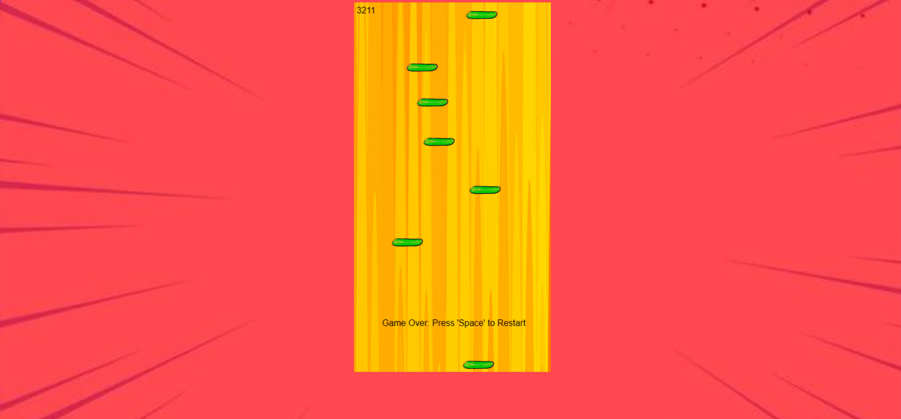

# Spider Jump

Spider Jump is an endless jumping game inspired by Doodle Jump, where the player controls a spider to jump higher and higher on platforms. The game is built using HTML, CSS, and JavaScript.

## How to Play

- Use the left and right arrow keys to move the spider.
- Jump on platforms to go higher.
- Avoid falling off the screen.

## Demo

You can play the game [here](link_to_your_game).

## Screenshots

## Technologies Used

- HTML
- CSS
- JavaScript

## License

This project is licensed under the MIT License - see the [LICENSE](LICENSE) file for details.
